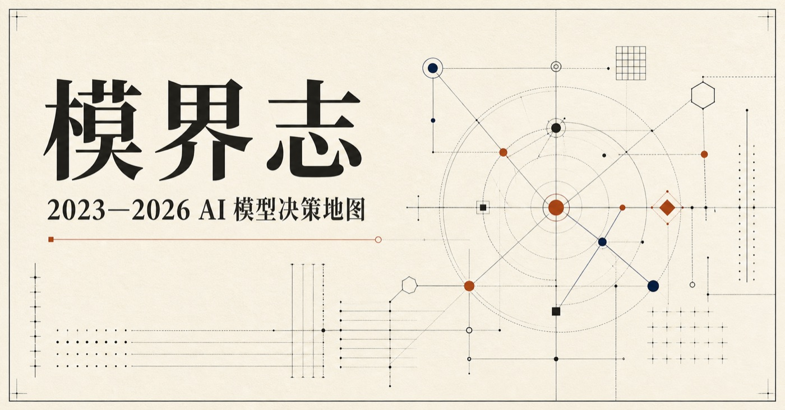
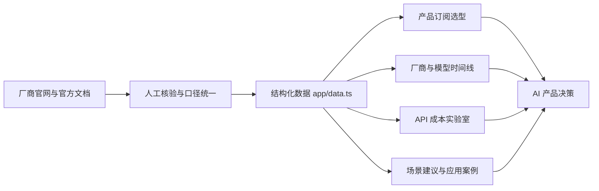

# 模界志｜2023—2026 AI 模型决策地图



一个面向 AI 产品经理、研发负责人和模型选型团队的开源决策网页。它把 2023—2026 年国内外主流模型厂商、个人订阅、API 价格、模型时间线、场景建议和公开应用案例放到同一套可检索、可比较的界面里。

> 数据快照：2026-09-07。价格、模型能力和产品权益会持续变化，采购或上线前请点击每条记录附带的官方来源复核。

## 它能做什么

- **按用途选个人订阅**：用“日常问答、写稿办公、写代码、做视频、做研究、只要免费”等标签筛选产品，并按厂商、档位、月费、核心模型、权益和备注横向比较。
- **查看厂商与技术路线**：按国内/海外以及推理、代码、多模态、Agent、RAG、低成本、私有化、开放权重等能力筛选 24 家代表厂商。
- **回看模型演进**：通过 2023—2026 年时间线理解聊天模型、多模态、推理模型和 Agent 系统的阶段变化。
- **估算 API 成本**：输入月请求数、平均输入/输出 Token、缓存命中率、业务通过率和汇率，估算月模型费、每千次请求成本与每个有效结果成本。
- **按场景建立 POC 短名单**：覆盖智能客服、企业知识库、代码助手、内容生产、语音与视觉等常见产品场景。
- **查看真实落地证据**：收录带官方来源和证据等级的应用案例，帮助区分“模型能力”与“业务结果”。
- **下载结构化数据**：页面内提供 Excel 快照，便于二次分析、评审和汇报。

网页版精选展示 **46 个订阅档位、24 家厂商、39 个时间线节点、29 条 API 价格、6 类场景和 10 个公开案例**。下载区提供包含 8 个工作表的完整 Excel 数据集，其中收录 96 个时间线节点、52 条 API 价格和 25 个公开案例。

## 信息如何流动



核心原则是：**不做“谁最强”的静态榜单，而是把模型放回具体任务、成本、延迟、部署和合规约束中比较。**

## 页面结构

| 模块 | 解决的问题 | 主要交互 |
| --- | --- | --- |
| 每周监测 | 最近核验了什么、哪些信息发生变化 | 查看核验日期、下次核验时间与变更摘要 |
| 产品订阅 | 个人用户该买哪个档位 | 用途、地区和关键词筛选；官网链接复核 |
| 厂商地图 | 哪些厂商适合进入候选池 | 地区、能力、部署方式和模型路线筛选 |
| 模型时间线 | 2023—2026 的关键演进是什么 | 按年份浏览模型发布节点 |
| API 价格实验室 | 在自己的流量假设下要花多少钱 | 调整请求量、Token、缓存、通过率和汇率 |
| 场景选型 | 某个业务场景先测哪些模型 | 查看 POC 候选、核心指标与建议动作 |
| 应用案例 | 模型在真实组织里如何落地 | 查看模型/底模、业务结果、证据等级与原文 |

## 本地运行

环境要求：Node.js `>= 22.13.0`。

```bash
npm install
npm run dev
```

生产构建：

```bash
npm run build
npm run start
```

默认开发地址由终端输出为准。

## 数据维护

主要内容集中在 [`app/data.ts`](app/data.ts)：

- `updateBrief`：本周核验状态与变更摘要
- `subscriptionPlans`：消费者订阅档位
- `vendors`：厂商与代表模型
- `timeline`：年度模型时间线
- `prices`：API 公开价格
- `scenarios`：场景选型建议
- `cases`：公开应用案例

更新数据时，请同时更新来源 URL、核验日期和必要备注，并遵循以下口径：

1. 优先使用厂商官网、官方定价页、模型文档或客户官方案例。
2. 消费者订阅月费与开发者 API 按量价格分开记录。
3. 保留官网原币、计费单位和适用条件，不用搜索摘要代替原始页面。
4. 登录后可见、地区动态价或证据冲突项标为“待人工核验”，不要猜测。
5. “低成本”以单位有效结果成本为准，同时关注成功率、返工率和延迟。

站点按“每周核验”流程维护；自动任务负责定期发起官方来源核验，确认后的变更才会进入数据和发布流程，避免页面结构变化或区域价格导致错误更新。

## 技术栈

- React 19 + TypeScript
- Vinext / Vite
- Next.js 兼容路由与元数据
- Tailwind CSS 4 工具链与自定义 CSS
- Cloudflare Workers 与 OpenAI Sites 构建插件
- 纯前端结构化数据，无数据库依赖

## 项目结构

```text
app/
├── data.ts          # 结构化数据与来源
├── globals.css      # 页面视觉与响应式样式
├── layout.tsx       # 页面元数据
└── page.tsx         # 交互与页面模块
public/
├── og.jpg           # 社交分享图 / README 预览图
├── favicon.svg
└── AI模型厂商全景_2023-2026.xlsx
```

## 部署

项目可以部署到支持 Node.js/Vite 构建的静态或 Serverless 平台。Fork 后请设置 `NEXT_PUBLIC_SITE_URL` 为自己的公开域名。可选的 D1/R2 绑定名分别通过 `SITES_D1_BINDING` 和 `SITES_R2_BINDING` 提供；本项目默认不依赖数据库或对象存储。

作者维护的演示站点：[模界志在线版](https://mojiezhi-ai-model-atlas.yellow-star-3002.chatgpt.site/)（访问权限由作者当前部署设置决定）。

## 贡献

欢迎通过 Issue 或 Pull Request 提交新模型、价格变动、失效链接和可核验的应用案例。提交数据前请阅读 [CONTRIBUTING.md](CONTRIBUTING.md)。

## 说明

- 本项目用于信息整理与产品选型参考，不构成采购、投资、法律或合规建议。
- 所有商标、模型名称和第三方资料归其各自权利人所有。
- 厂商公开的客户案例与效果指标通常未经独立审计，正式决策前应使用自己的数据集复测。

## License

[MIT](LICENSE)
